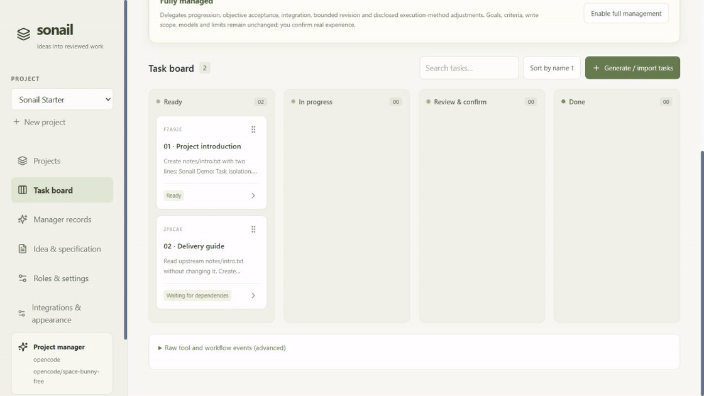

<div align="center">


# Sonail

### Let AI do the project. Keep the direction yours.

A local AI project workbench · project manager · independent review · human acceptance

**English** · [简体中文](README.zh-CN.md)

[](https://github.com/lexingtonhibiki/sonail/actions/workflows/ci.yml)
[](LICENSE)
[](https://github.com/lexingtonhibiki/sonail/releases)

[Download](https://github.com/lexingtonhibiki/sonail/releases) · [Quick start](#quick-start) · [Guide](docs/guide.md) · [Feedback](https://github.com/lexingtonhibiki/sonail/issues)

</div>



> **0.1 preview, Windows first.** An MIT derivative of [AI Agent Board](https://github.com/DanWahlin/ai-agent-board). GIFs show real UI interactions with seeded demo tasks, not a model run or automatic acceptance.

## From an idea to an accountable delivery

You know what you want. You may not want to interpret every test log or technical criterion. Sonail gives the project a manager, executor and separate reviewer, with visible conclusions and next steps.

| Role | Responsibility |
| --- | --- |
| Project manager | Draft specifications/tasks, review against project goals, explain decisions and revisions |
| Executor | Complete a task in an isolated Git worktree and retain progress/deliverables |
| Independent reviewer | Check criteria with evidence, distinguish blockers from suggestions, request revisions |
| You | Confirm the plan, experience the result when needed, set autonomy permissions |

**Execution finished ≠ review passed ≠ accepted ≠ integrated.** Dependencies unlock after integration. Dragging to Done does not bypass acceptance.

## What's here

- **Light bilingual UI:** sage, warm paper and iris palettes, sidebar navigation and searchable settings.
- **Project overview:** ten recent projects, categories, pins, search, expandable tasks, archive/restore.
- **Task cards:** drag and sort by name, integrate from a card, dependency explanations and copy feedback.
- **Manager records:** conclusions, blockers, next steps and revisions; original execution detail retained.
- **Bounded autonomy:** disclosed fully managed mode, concurrency/revision limits, human experience gates.
- **Your models:** set each role's harness/model/reasoning; automatic selection uses your candidate list.
- **Optional Codex quota card:** remaining account limits and an opt-in community reset outlook, with hide/collapse and source timestamps. [Guide](docs/QUOTA.md)
- **Shared tools directory:** configurable per machine, with a Windows D-drive/user-data fallback and consistent AI/manual instructions. [Guide](docs/TOOLS.md)
- **Persistent local state:** SQLite, desktop launcher and Windows login startup; AI pauses on restart.

**AI task import:** project-scoped read/preview credentials, a generation skill and MCP bridge. Inspect a readable plan before confirming cards. [Guide](docs/AI-INTEGRATION.md)

## Quick start

Requires **Windows 10/11, Node.js 22 or 24, Git** and an installed/authenticated harness. Model charges and permissions belong to its provider.

**Download:** extract `sonail-*-windows.zip` from [Releases](https://github.com/lexingtonhibiki/sonail/releases) to a stable folder. Run `Setup.cmd` once, then `Open-Sonail.cmd`. Setup needs internet; native SQLite may require build tools if no prebuilt binary is available. Node/npm are not bundled.

**From source:**

```powershell
git clone https://github.com/lexingtonhibiki/sonail.git
cd sonail
npm ci
npm run build
.\Open-Sonail.cmd
```

Open **http://127.0.0.1:19101/workbench**.

1. Create a project using a local Git repository with an initial commit. Commit your intended baseline.
2. Choose authenticated harnesses/models in **Roles & settings**.
3. Describe your idea and ask the manager to draft, or import [the two-task example](examples/demo.en.json). Importing does not call a model.
4. Confirm/publish the plan; start unlocked tasks. Read **Manager records** and task evidence.
5. Confirm human experience criteria, accept, integrate, then advance. Automatic advancement is opt-in.

## Harness status

| Integration | Current evidence |
| --- | --- |
| OpenCode | Preferred; actual free-model execution, reviewer, manager and user integration demonstrated |
| Codex | Native SDK adapter; our account rejected selected models, so verify your account's capabilities |
| Claude Code / DeepSeek Harness | Adapters implemented; real-credential end-to-end acceptance pending |
| OpenAI / Anthropic compatible endpoints, local models | Through OpenCode; requires endpoint/model capabilities |
| Other harnesses, balances | Planned; see [Roadmap](docs/ROADMAP.md) |

The manager currently creates separate native calls with project context, not one persistent native chat. Parts of the detailed pane remain English-only.

## Data and trust

The launcher binds to loopback. Tasks/events are in `data/board.db`; specifications, permissions, reviews and endpoint keys are in `data/workflow.json`. Stop this instance before backing up all of `data/`. Keys are local plaintext, not an OS keyring. Do not share data, logs or `.env`. Read-only prompts are not an OS sandbox: [Security](SECURITY.md).

**Integrations & appearance → Service & startup** manages the desktop entry and current-user login startup without administrator access. AI pauses after restart. `停止Sonail.cmd` stops only this instance.

## Contribute

Chinese/English reports welcome: [Contributing](CONTRIBUTING.md), [Architecture](docs/ARCHITECTURE.md). Integration contracts support compiled source adapters; arbitrary plugin loading is not implemented.

If Sonail saves you time babysitting tasks, consider a Star or share a workflow you actually completed.

## License and credits

[MIT](LICENSE). Thanks to [DanWahlin/ai-agent-board](https://github.com/DanWahlin/ai-agent-board) for the board, streaming and worktree foundation. [Attribution](NOTICE.md) · [Dependency notices](THIRD_PARTY_NOTICES.txt).
