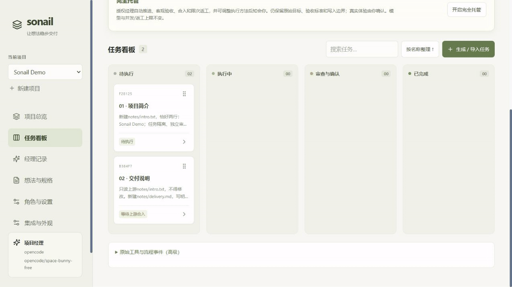

<div align="center">


# Sonail

### 让 AI 做项目，让你把握方向。

本地 AI 项目工作台 · 项目经理 · 独立审查 · 人工体验验收

[English](README.md) · **简体中文**

[](https://github.com/lexingtonhibiki/sonail/actions/workflows/ci.yml)
[](LICENSE)
[](https://github.com/lexingtonhibiki/sonail/releases)

[下载试用](https://github.com/lexingtonhibiki/sonail/releases) · [快速开始](#快速开始) · [使用指南](docs/guide.zh-CN.md) · [反馈](https://github.com/lexingtonhibiki/sonail/issues)

</div>



> **0.1 预览版，Windows 优先。** 基于 MIT 的 [AI Agent Board](https://github.com/DanWahlin/ai-agent-board) 二开。GIF 为真实界面与预置演示任务，不代表模型执行或自动验收。

## 从想法到交付，少一点盯梢

你有需求，却不一定能看懂代码、测试日志或技术验收条件。Sonail 给项目配上经理、执行者和独立审查者，让结论和下一步出现在看板里。

| 角色 | 负责什么 |
| --- | --- |
| 项目经理 | 起草规格与任务；带着全局目标把关；解释结论和整改意见 |
| 执行者 | 在独立 Git worktree 中执行，保留过程和产物 |
| 独立审查者 | 按条件取证，区分阻塞问题与可选建议，要求返工 |
| 你 | 确认方案；在需要体验时点头；控制推进权限 |

**执行结束 ≠ 审查通过 ≠ 用户验收 ≠ 合入。** 上游合入才解锁下游，拖到 Done 不算验收。

## 已有功能

- **亮色中英界面**：鼠尾草、暖纸、鸢尾主题，侧边导航、可搜索设置。
- **多项目总览**：最近活跃前 10、分类、置顶、名称搜索、任务简略展开、归档恢复。
- **拖拽任务卡**：名称排序、卡片直接合入、依赖阻塞提示、复制反馈。
- **经理记录**：结论、卡点、下一步与整改意见集中显示；原版详细视图保留执行过程。
- **受控自动推进**：披露式“完全托管”，并发与返工上限，用户体验条件始终留给你。
- **自由选模型**：三角色分别设置 harness、模型、思考等级；自动档位从你的候选中选。
- **本地持久化**：SQLite、桌面入口、Windows 登录自启动；AI 重启后暂停。
- **Codex 额度悬浮卡**：账户剩余额度、可选社区刷新展望，支持收起/隐藏和来源时间。[使用说明](docs/QUOTA.md)
- **工具目录可配置**：有 D 盘默认 D:/DevTools，否则落在用户数据目录；规划、派发和手动交接一致。[使用说明](docs/TOOLS.md)
- **AI 方案导入**：项目范围只读/送审凭据、生成技能与 MCP；先看可读方案，再确认创建卡片。[使用说明](docs/AI-INTEGRATION.md)

## 快速开始

需要 **Windows 10/11、Node.js 22 或 24、Git**，以及已安装、已登录的 harness。模型费用与执行权限由对应提供方管理。

**下载版：** 从 [Releases](https://github.com/lexingtonhibiki/sonail/releases) 下载 `sonail-*-windows.zip`，解压到固定目录。第一次运行 `Setup.cmd`，然后运行 `Open-Sonail.cmd`。首次需要联网；原生 SQLite 缺少预编译包时可能需要编译工具。下载包不包含 Node/npm。

**源码版：**

```powershell
git clone https://github.com/lexingtonhibiki/sonail.git
cd sonail
npm ci
npm run build
.\Open-Sonail.cmd
```

打开 **http://127.0.0.1:19101/workbench**。

1. 准备已有初始提交的本地 Git 项目，提交希望作为执行起点的修改。
2. 新建项目，在“角色与设置”选择已登录的 harness 和模型。
3. 填写原始想法，让经理起草；也可导入 [两任务示例](examples/demo.zh-CN.json)，导入本身不调用模型。
4. 核对并发布方案，启动解锁的任务；在“经理记录”和任务详情查看结论与证据。
5. 需要体验时由你确认；验收、合入，再推进下游。自动推进默认关闭。

## 接入状态

| 接入 | 当前证据 |
| --- | --- |
| OpenCode | 首选；真实免费模型完成执行、独立审查、经理把关与用户合入 |
| Codex | 原生 SDK 已适配；本机账号曾拒绝所选模型，需核对你账号实际能力 |
| Claude Code / DeepSeek Harness | 已实现适配，真实凭据端到端验收待做 |
| OpenAI / Anthropic 兼容接口、本地模型 | 经 OpenCode 执行，需要端点和模型支持对应能力 |
| 其他 harness、余额 | 后续规划，见 [路线图](docs/ROADMAP.md) |

经理目前带项目上下文发起独立调用，尚非长期复用的原生会话。详细执行面板仍有部分英文。

## 数据与权限

启动器只监听本机。`data/board.db` 保存任务/事件，`data/workflow.json` 保存规格、权限、审查和接口密钥。备份时停止本实例，再复制整个 `data/`。密钥尚未使用系统密钥库，请勿分享数据、日志或 `.env`；只读提示词不等于系统沙箱。见 [安全说明](SECURITY.md)。

“集成与外观 → 服务与启动”管理桌面入口和当前用户登录自启动，无需管理员权限；AI 重启后暂停。`停止Sonail.cmd` 仅停止本实例。

## 参与与致谢

欢迎中文/英文反馈，尤其是初次使用卡点。[贡献指南](CONTRIBUTING.md) · [架构说明](docs/ARCHITECTURE.md)。集成契约用于源码适配与编译接入，目前没有任意插件加载。

如果 Sonail 帮你省下了盯任务的时间，欢迎 Star，也欢迎分享真正跑通的场景。

[MIT](LICENSE)。感谢 [DanWahlin/ai-agent-board](https://github.com/DanWahlin/ai-agent-board) 提供看板、实时事件与 worktree 基础。[上游来源](NOTICE.md) · [依赖声明](THIRD_PARTY_NOTICES.txt)。
