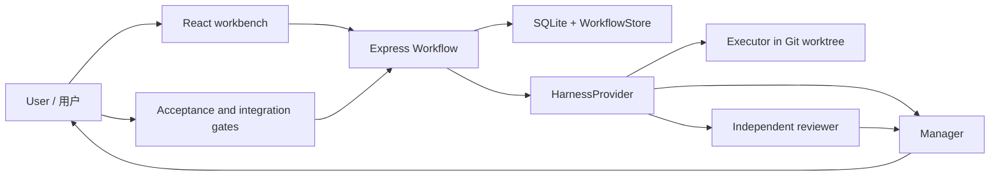

# Architecture / 架构

- `shared/workflow.ts`: proposals, role profiles, criteria, review contracts and objective acceptance rules.
- `shared/quota.ts` and `services/quota.ts`: separate account/source adapters, owner-only quota route, shared one-minute cache and optional source attribution; see [quota contract](QUOTA.md).
- `shared/workbench.ts`: project overview, appearance and versioned source integration contracts.
- `packages/server/src/services/workflow.ts`: lifecycle, dependency/revision checks, bounded advancement and Git integration.
- `workflow-store.ts`: persisted project context/configuration; `harness.ts`: adapters; `local-service.ts`: native Windows startup actions.
- `ai-access.ts`: hashed project credentials; `ai-integration.ts`: read/preview-only HTTP gateway. Imported drafts reuse the workflow's Proposal and confirmation gate; `scripts/sonail-mcp.mjs` is a stdio bridge using the official SDK.
- `packages/client/src/components/Workbench.tsx`: product entry at `/workbench`. Project hub, manager records and integration settings remain separate UI concerns. `/projects` retains upstream execution detail.

Adapters must report capabilities and failures honestly, preserve selected models/effort, and never treat finished execution as accepted work. Objective automation requires passing independent reviewer and manager evidence. Human criteria are never automatically accepted. Supplementary manager adjustments are audited and cannot change canonical criteria.

集成扩展使用 `IntegrationAdapter<T>` / `apiVersion: 1`，通过源码实现并编译接入。它不是动态插件市场。角色与任务、模型与费用来源、执行与验收保持独立。
